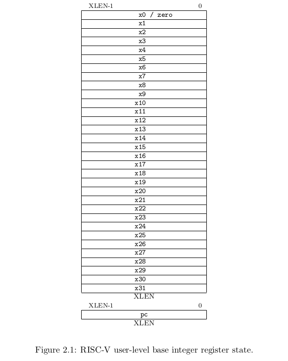
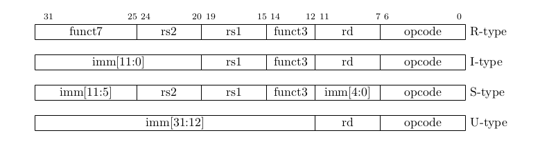
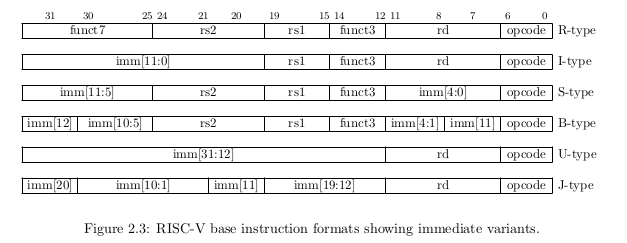
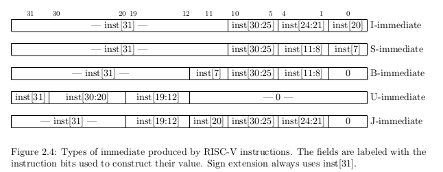
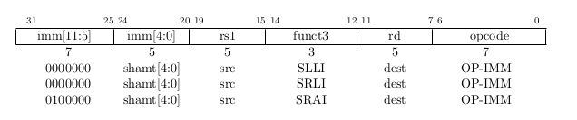
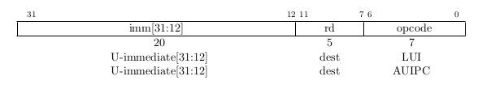
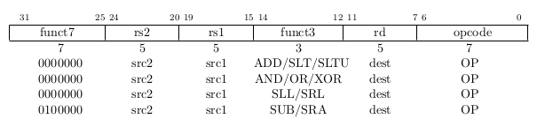
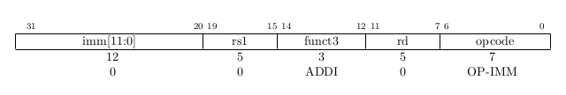
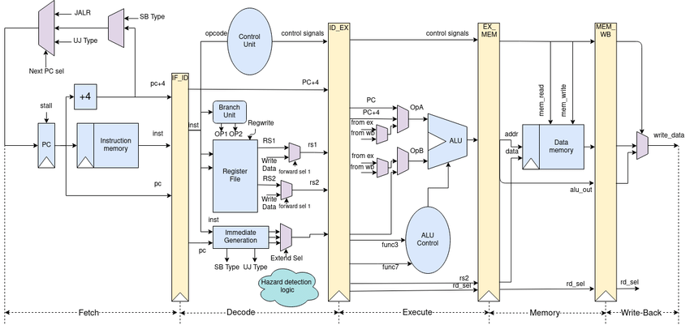

# RV32IM-pipeline-implementation

# Table of Contents

1. [Introduction](##introduction)
2. [Programmer Model for Base Integer Subset](### Programmers Model for Base Integer Subset)

## Introduction

The objective of this project is to design and implement a 5 stage pipeline CPU to support the RISC-V instruction architecture. This pipeline CPU supports the entire RV32IM ISA which contains 45 instructions. The designed pipeline CPU is implemented using behavioral modeling in verilogHDL and icarus Verilog is used to compile and simulate. gtkWave is used to observe the behavior.

## RV32I Base Integer Instruction Set Version 2.0


### Programmers Model for Base Integer Subset

 ISA designed to require minimumal implementation. 
 RV32I contains,
    - 47 unique instructions


There are 31 general purpose registers
    - x1 - x31 hold integer values
    - x0 hardwired to constant 0.
    - no hardwired lr but calling convention uses x1 to hold return address on 
a call. 
    - for RV32 32 bits wide registers.
    - One additional user-visible register, program counter -> pc.



### Base Instruction Formats

Four core instruction formats -> R/I/S/U

All fixed 32bit in length and must aligned on 4 byte boundary in memory. 
An instruction address misaligned exception is generated on a taken branch or 
unconditional jump if targer is not 4 byte aligned. 

No instruction fetch misaligned exception is generated for conditional branch 
that is not taken.



Each immediate subfield is labeled with the bit position (imm[x]) in the 
immediate value being produced, rather than within ins's immediate field as
usually done. 

ISA keeps rs1,rs2 and rd at same posiitons in all formats -> simplify decoding.
Except for 5-bit immediates in CSR instructions. Immediates leftmost and sign bit always on 31 bit. 

### Immediate Encoding Variants

Further two variants of instruction formats -> B/J 
based on handling immediates.

Difference between S and B is that the 12 bit immediate field used to 
encode branch offsets in multiples of 2 in B format.
Instead of shifting all bits in the instruction encoded immediate left 
by one in hardware as convention the middle bits (imm[10:1]) and sign bits
stay in fixed positions 

Only difference between U and J formats is the 20 bit immediate shifted to left
by 12 bits to form U immediates and by 1 to form J immediates. Locations of 
format immediates chosen to maximize overlap with other formats.



types of immediates produced by each instruction formats and labeled to show
which instruction bit (inst[y]) produces each bit of the immediate value. 



### Integer Computational instructions

Most integer computational instructions operate on XLEN bits of values
held in the integer register file. The computational instructions are either 
encoded as,
    - register-immediate (I type)
    - register-register (R type)

Destination register rd for both. No integer computational instruction cause 
arithmetic exceptions. (overflow check no special instruction in base set 
as many checks are cheaply implemented usign RISCV branches) 

Unsigned addition require only single additional branch after addition
```
add t0, t1, t2;
blu t0, t1, overflow;

```

For signed addition (one operand's sign is known) require only single branch 
after addition
```
addi t0, t1, +imm;
blt  t0, t1, overflow;
```

For general signed addition three additional ins after the addition required. 
```
add t0, t1, t2
slti t3, t2, 0
slt t4, t0, t1
bne t3, t4, overflow
```
#### Integer Register-Immediate Instruction


ADDI adds sign-extended 12bit immediate to register rs1.
Arithmetic overflow ignored and result simply the low XLEN bits of the result.

ADDI rd, rs1, 0 used for MV rs,rs1. 

SLTI (set less than immediate) rd = 1 if (rs1<signed extended immediate) else 0
when both are treated as signed numbers.

SLTIU similar but compares values as unsigned numbers. (immediate is first 
sign extended to XLEN and then treated as an unsigned number)

SLTIU rd, rs1, 1 sets rd to 1 if rs1 equals zero otherwise sets rd to 0 
(pseudo-op SEQZ rd, rs)

ANDI, ORI, XORI are logical operations perform bitwise AND, OR, XOR on 
rs1 and sign extended 12 bit immediate and place the result and rd. 

NOTE: XORI rd, rs1, -1 --> bitwise logical inversion of reg rs1 (pseudo-ins NOT rd,rs)



Shifts by a constant are encoded as a specialization of the I-type format.
operand -> rs1 
shift amount -> lower 5 bits of the I-immediate field. 
shift type -> high bit of the I-immediate. 

SLLI logical left shift
SRLI logical right shift
SRAI arithmetic right shift

(logical zeros are shifted arithmetic original sign is copied)



LUI (load upper immediate) is used to build 32bit constants and uses U-type
format. Places the U-immediate value in the top 20 bits of destination reg rd,
lowest 12 bits with zeros. 

AUIPC (add upper immediate to pc) used to build pc-relative addresses and uses
U-type format. AUIPC forms 32-bit offset from the 20-bit U-immediate filling 
lowest 12 bits with zeros , adds the offset to the pc then place result on rd.

AUIPC instruction supports two instruction sequences to access arbitrary
offsets from the PC for both, 
    - control flow -> combination of an AUIPC and the 12 bit immediate in a JALR can transfer control to any 32 bit pc-relative address 
    - data access -> AUIPC plus the 12-bit immediate offset in regular load or store instructions can access any 32-bit pc-relative data address. 

current PC obtained by setting the U-immediate to 0, Although a JAL + 4 
instruction could also can also be used, might cause pipeline breaks in simpler
microarchitectures of pollute the BTB structures in more complex microarchitectures.

#### Integer Register-Register Operations



Several R-type operations defined. All operations read rs1 and rs2 and write
result into register rd. func7 and func3 select the ADD and SUB.
Overflows ignored and low XLEN bits of results are written to the destination,

SLT - signed compare 
SLTU - unsigned compare 
( rd = 1 if (rs1<rs2) else 0 )

NOTE: SLTU rd, x0, rs2 sets rd to 1 if rs2 not equal (pseudo-op SNEZ rd,rs)
AND, OR m XOR perform bitwise logical operations.

SLL, SRL, SRA logical left, logical right and arithmetic right on the value on 
reg rs1 by shift amount held in the lower 5 bits of register rs2. 

#### NOP Instruction



Does not change user-visible state except advancing the pc. NOP is encoded as 
ADDI x0, x0, 0

Can be used to align code segments to microarchitecturally significant address 
boundaries, or to leave space for inline code modifications. 

### Control Transfer instructions

 RV32I provides two types of control transfer instructions
    - unconditional jumps
    - conditional branches

Do not gave architecturally visible delay slots.


#### Unconditional Jumps

JAL - Jump and link (J type) format 
J immediate encodes a signed offset in multiples of 2 bytes. 
Offset is sign extended & added to the pc to form jump targer address. 

Hence jumps can target a +/- 1MiB range. 
JAL stores the address of the instruction following the jump (pc+4) into rd

Standard software calling convention uses x1 as the return address register and 
x5 as an alternate link register. 

plane unconditional jumps (pseudo-op J) as JAL rd = x0

JALR - indirect jumo instruction JALR (jump and link register) uses I - type 
encoding. Target address is obtained by adding the 12-bit signed 
I-immediate to the register rs1 and setting the least-significant bit of the 
result to zero. 

Address of instruction following the jump (pc+4) is written to register rd.
Register x0 can be used as the destination if teh result is not required.




https://www.csl.cornell.edu/courses/ece5745/handouts/ece5745-tinyrv-isa.txt#:~:text=RISC%2DV%20has%20an%20asymmetric,bit%2031%20of%20the%20instruction.


